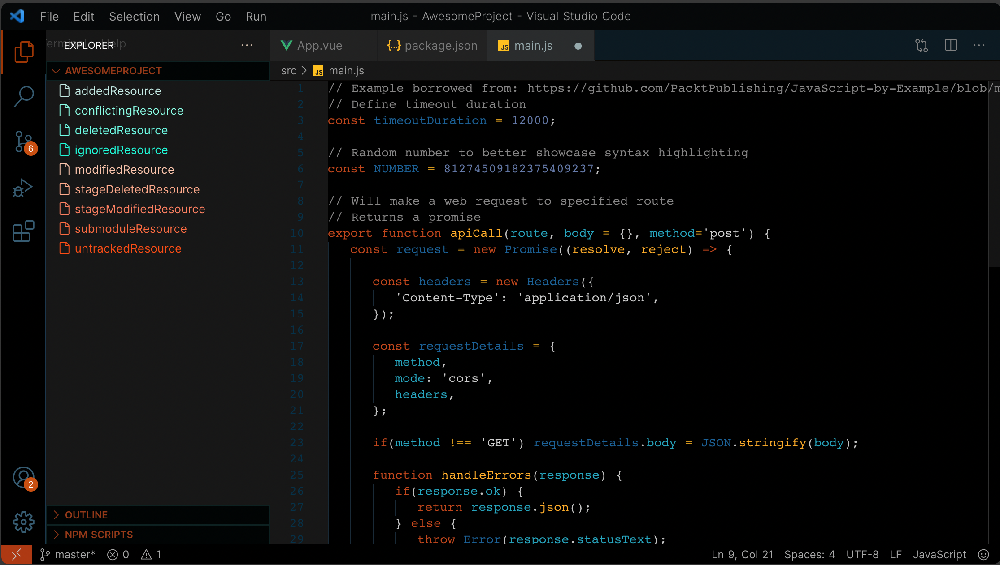
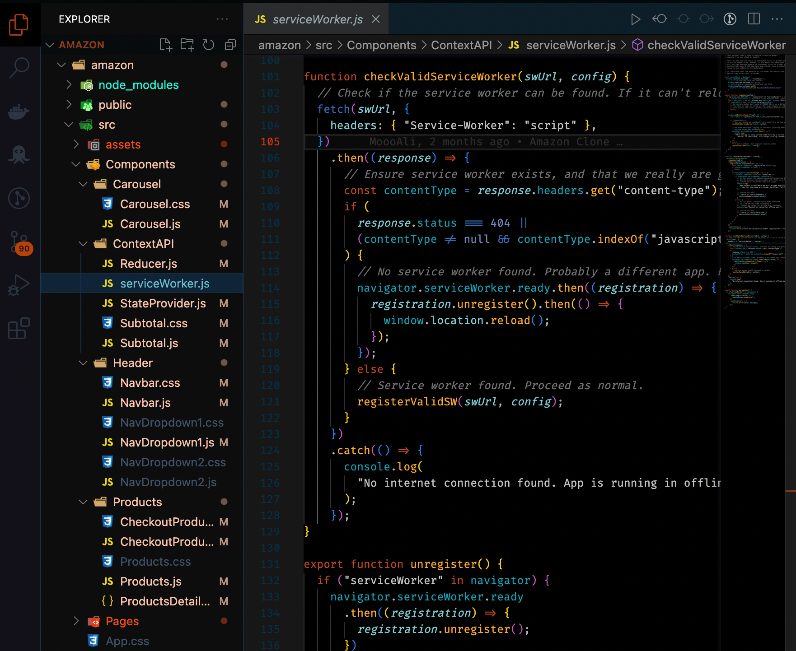

## Anubis Dark Theme

## Theme installed

## Installation

1.  Install [Visual Studio Code](https://code.visualstudio.com/)
2.  Launch Visual Studio Code
3.  Choose **Extensions** from menu
4.  Search for `Anubis Dark Theme`
5.  Click **Install** to install the theme
6.  Choose Color Theme > **Anubis Dark Theme**
or [install the base theme from the VS Marketplace](https://marketplace.visualstudio.com/items?itemName=MoAli.anubis-dark-theme)

Please make sure the theme color doesn't conflict with VSC WorkBench Color Customizations!

Theme should look in Taps - Bars - Syntax as the Pictures, if not so you have override VSC color confliction from a previous theme!

GitHub Contact at [Mo Ali](https://github.com/devMoAli)
